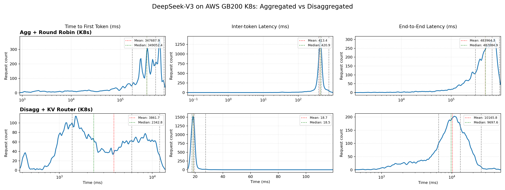

# Dynamo Consolidated Exemplar

This directory contains the current configuration as of February 20 for the Dynamo Consolidated Exemplar, including setup instructions, deployment configurations, and benchmark results achieved on an AWS GB200 Kubernetes cluster.

### Deploy Configurations

The `deploy/` directory contains the YAML files needed to deploy Dynamo-TRTLLM workers.

- **Dynamo Baseline** (Aggregated serving + Round Robin routing; 4 DEP8 workers): `agg.yaml`
- **Dynamo Consolidated** (Disaggregated serving + KV routing; 2 DEP8 prefill workers, 2 DEP8 decode workers): `disagg.yaml`


#### Docker
As of Dynamo 0.9.0, the release branch does not have support for DP-level routing in TRTLLM. Our containers are built from commit `b5c0db6` [link](https://github.com/ai-dynamo/dynamo/commit/b5c0db63c3914513c445c829f6dafcdef9e0f62d). Replace `<dynamo-trtllm-container-path>` [e.g. here]((deploy/agg.yaml#L126)) with your build wherever relevant

#### Setup Notes

- In our setup, the deployments require a ComputeDomain to be configured to ensure MNNVL-connected pods. An example is provided in `deploy/_compute-domain.yaml`, which is the ComputeDomain referenced by the deployment YAMLs. Modify or remove according to your configuration needs.

### Benchmark Settings

The `perf/` directory contains the trace data and YAML configuration for [AIPerf](https://github.com/ai-dynamo/aiperf/tree/main)-based benchmarking. For live debugging, use AIPerf's real-time metrics board TUI.

To reproduce our experiments, use `perf/conversation_trace_synth_16.00x1+10.00_speedup1_maxisl110000.jsonl`. (We also include a "mini" version for quick iterations, with the first 2000 trace entries.) This is a Mooncake-style trace file synthetically generated using Dynamo's [prefix data generator tool](https://github.com/ai-dynamo/dynamo/tree/main/benchmarks/prefix_data_generator). The ISL/OSL/cache hit statistics of the trace is below.

<details>
<summary>Dataset statistics: Mooncake-based Synthetic Trace</summary>

```
============================================================
  DATASET ANALYSIS: Mooncake-based Synthetic Trace
  ============================================================
  OVERVIEW
  ----------------------------------------
    Total Requests:      10,000
    Unique Hash Blocks:  430,838
    Total Hash Blocks:   770,934
  INPUT SEQUENCE LENGTH (ISL)
  ----------------------------------------
    Average:             39,186 tokens
    Maximum:             109,459 tokens
    Minimum:             12,801 tokens
  OUTPUT SEQUENCE LENGTH (OSL)
  ----------------------------------------
    Average:             344 tokens
    Maximum:             2,000 tokens
    Minimum:             1 tokens
  KV CACHE / PREFIX REUSE
  ----------------------------------------
    Block-level Hit Rate: 44.1%
    Token-level Hit Rate: 44.0%
    Avg Context (shared): 22,400 tokens/req
    Avg Unique Prompt:    16,786 tokens/req
    Shared Prefix Ratio:  57.2%
  ============================================================

  Summary:
  • ~44% KV cache hit rate (block/token level) based on hash_id overlap across requests
  • ~57% of input tokens come from shared context prefixes
  • Long-context workload: avg 39K input tokens, up to 109K max
```

</details>

## Expected Benchmark Results

The trace spans approximately 85 minutes, and the benchmark is expected to take between 90 and 120 minutes to complete.
We report the results of experiments on our AWS GB200 K8s cluster below.



The plot can be reproduced from AIPerf profiler outputs using [`perf/plot_metric_distributions.py`](perf/plot_metric_distributions.py).

### Aggregated + Round Robin

```
============ Serving Benchmark Result ============
Request throughput (req/s):              1.67
Output token throughput (tok/s):         556.82
Total Token throughput (tok/s):          65845.03
---------------Time to First Token----------------
Mean TTFT (ms):                          347687.94
Median TTFT (ms):                        349052.40
P99 TTFT (ms):                           781814.19
-----Time per Output Token (excl. 1st token)------
Mean TPOT (ms):                          413.45
Median TPOT (ms):                        420.85
P99 TPOT (ms):                           745.78
---------------Inter-token Latency----------------
Mean ITL (ms):                           413.45
Median ITL (ms):                         420.85
P99 ITL (ms):                            745.78
----------------End-to-end Latency----------------
Mean E2EL (ms):                          483964.31
Median E2EL (ms):                        487084.88
P99 E2EL (ms):                           945071.80
==================================================
```

> **Note — Agg+Round Robin K8s vs Slurm discrepancy:** Results are inconsistent on the Agg+Round Robin baseline between the NVL36 GB200 Slurm cluster and the AWS GB200 K8s cluster. We are working to debug the performance degradation on the K8s cluster.

<details>
<summary>Aggregated + Round Robin results on Slurm (NVL36 GB200)</summary>

```
============ Serving Benchmark Result ============
Request throughput (req/s):              1.77
Output token throughput (tok/s):         573.84
Total Token throughput (tok/s):          69870.34
---------------Time to First Token----------------
Mean TTFT (ms):                          116459.05
Median TTFT (ms):                        63300.30
P99 TTFT (ms):                           530646.24
-----Time per Output Token (excl. 1st token)------
Mean TPOT (ms):                          359.23
Median TPOT (ms):                        395.87
P99 TPOT (ms):                           760.20
---------------Inter-token Latency----------------
Mean ITL (ms):                           359.23
Median ITL (ms):                         395.87
P99 ITL (ms):                            760.20
----------------End-to-end Latency----------------
Mean E2EL (ms):                          227972.56
Median E2EL (ms):                        191250.95
P99 E2EL (ms):                           711083.78
==================================================
```

</details>

### Disaggregated + KV Router

```
============ Serving Benchmark Result ============
Request throughput (req/s):              1.96
Output token throughput (tok/s):         674.81
Total Token throughput (tok/s):          77648.90
---------------Time to First Token----------------
Mean TTFT (ms):                          3861.69
Median TTFT (ms):                        2342.79
P99 TTFT (ms):                           11993.38
-----Time per Output Token (excl. 1st token)------
Mean TPOT (ms):                          18.73
Median TPOT (ms):                        18.54
P99 TPOT (ms):                           27.56
---------------Inter-token Latency----------------
Mean ITL (ms):                           18.73
Median ITL (ms):                         18.54
P99 ITL (ms):                            27.56
----------------End-to-end Latency----------------
Mean E2EL (ms):                          10165.80
Median E2EL (ms):                        9697.64
P99 E2EL (ms):                           26077.58
==================================================
```
